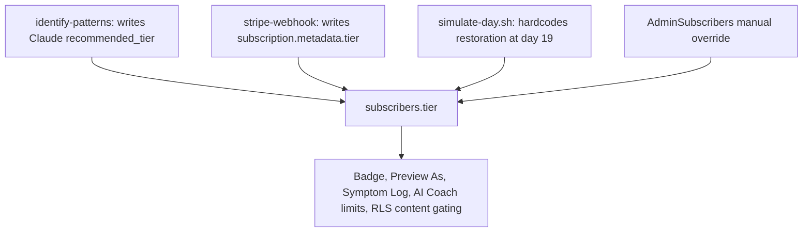

# Batch 1 Implementation Plan, revised after Sheila's corrections

## What changed versus the original Batch 1

Three things moved as a direct result of her corrections:

- **Added: unify the two tier recommenders.** Her "everything comes back Integration" report is a real second bug, separate from the badge bug. Two engines disagree today.
- **Changed: the effective tier helper is now trial-aware.** Her Decision 1 answer defines a trial model the code does not implement, and the helper has to encode the rule even though Stripe work lands in Batch 2.
- **Removed: the trial-overrides-tier group concern.** Correct behaviour under her model. The add-only group bug remains, in Batch 2.
- **Added: pattern severity scoring, pulled forward from Batch 3**, so her assessment retest is coherent in one sitting.
- **Added: a place to hold the tier a member picks during the trial**, which falls directly out of the confirmed trial rule below.

Effort moves from about 40h to about **70h, roughly 9 working days**, including 6h for the requirements record described below.

---

## How Batch 1 looks from Sheila's side

The point of a gated batch is that she can confirm it. Measured against that, Batch 1 currently splits badly:

- **About 40h produces something she can click**, and it closes about 29 of the 61 rows she did not pass.
- **About 24h produces nothing she can see**: migration hygiene, the error boundary, the Clerk identity binding and lifecycle webhooks, the price audit, and our own verification. That is 38 percent of the batch invisible to the person being asked to approve it.

That split is defensible, because the invisible work is what makes the visible work provable and has to precede real card payments, but it must be stated to her plainly rather than discovered. Her sheet says so in a short preamble: this batch also contains foundation work you cannot test, here is what it is and why it comes first.

### Assessment scoring is fixed in one piece, decided

The tier recommender and the pattern severity labels read the same intake answers. Shipping only the recommender would have her run a mild assessment, see a sensible tier next to pattern cards still labelled medium and high, and correctly mark it Fail. Severity scoring therefore moves into Batch 1 rather than waiting for Batch 3, so she judges the whole scoring surface once. The assessment is the part of the product only she can evaluate, so it gets a coherent screen or it gets nothing.

---

## The four writers of `subscribers.tier`

Nothing in the code treats this column as "what you paid for". Every fix below exists to make that one sentence true.



Evidence for the assessment writing the badge column:

```223:230:supabase/functions/identify-patterns/index.ts
    await supabase
      .from("subscribers")
      .update({
        tier: result.recommended_tier,
        track,
        intake_completed: true,
      })
      .eq("id", subscriber_id);
```

Evidence for the script that most likely produced the Restoration badge in her testing:

```288:298:scripts/simulate-day.sh
if [[ "$TARGET_DAY" -ge 19 && "$DIRECTION" == "forward" ]]; then
  case "$TIER" in
    awareness|foundation|guided|"")
      NEW_TIER="restoration"
      sb_patch "subscribers?id=eq.${SUB_ID}" "{\"tier\": \"restoration\"}" >/dev/null
```

---

## The confirmed trial rule, and what it forces

Her model: $19 one-time for 21 days, Foundation access days 1 to 18, Restoration days 19 to 21, then auto-bill $29 Foundation unless changed. **Confirmed: a tier chosen during the trial does not grant access before day 22.** Everyone on trial sees Foundation, then Restoration from day 19.

So `useEffectiveTier()` resolves in this order:

- `payment_status = 'none'` gives free, no tier claimed
- `payment_status = 'trial'` and day 1 to 18 gives foundation, whatever they picked
- `payment_status = 'trial'` and day 19 to 21 gives restoration
- `payment_status = 'active'` gives `subscribers.tier`, which by then means what they pay for
- `past_due` and `cancelled` keep their existing handling

**The consequence:** if a member can pick a tier during the trial but that pick must not take effect until day 22, the selection cannot live in `subscribers.tier`. It needs its own home, either a `pending_tier` column or a read of the Stripe subscription. Batch 1 adds the column, since the migration work is already open, and Batch 2 makes billing honour it at day 22. Without this the trial rule cannot be implemented without losing the member's choice.

Still to confirm, and not blocking Batch 1: whether the $19 is charged upfront at checkout, which would remove the Stripe free trial entirely and reshape Batch 2.

---

## Prerequisites, 7h

- **Migration hygiene, 6h.** `sql/portal_schema.sql` and `sql/rls_policies.sql` are applied by hand, so we cannot prove production matches the repo. Bring both under `supabase/migrations` as idempotent migrations and add the missing unique constraint on `subscriber_progress.subscriber_id` that its own upserts depend on. This goes first because every later item is a database change we need to prove landed.
- **Route error boundary, 1h.** There is no error boundary anywhere in `src/**`. Any render throw white-screens the whole portal outlet, which is precisely how the blank editor bug presented.

## Tier truth and assessment scoring, 34h

- **Stop the assessment writing the badge, 3h.** `identify-patterns` writes to `pattern_maps.recommended_tier` only. Also fixes the case at lines 121 to 124 where a missing Claude key silently writes `tier: "awareness"`.
- **Unify the two recommenders, 6h.** Retire the duplicate so one engine produces one recommendation. The `subcategoryCount >= 8 || average_baseline < 3` OR condition in [src/lib/tier-recommendation.ts](src/lib/tier-recommendation.ts) implements the "whichever is higher" proposal from her clarifications document, whose own status line records that she never answered it. This is therefore a pending question being closed, not a defect being patched: **we propose thresholds, she approves them, then we build.** Nothing ships here without her written answer.
- **Remove the tier write from the day simulator, 1h.** `simulate-day.sh` stops mutating `subscribers.tier`.
- **Pattern severity scoring, 8h, pulled forward from Batch 3.** Mild ratings of 7 to 10 must produce mild patterns. Same intake data as the recommender, so the two are corrected together and reviewed by Sheila as one change.
- **Trial-aware `useEffectiveTier()`, 8h.** One helper implementing the rule above, replacing the `isAdmin && previewTier !== "admin" ? previewTier : subscriber?.tier` ternary duplicated across six portal pages, plus the four hooks and libs that read tier separately and each apply their own inconsistent trial logic. Includes the `pending_tier` column so a trial member's choice survives until day 22.
- **Clean the polluted rows, 2h.** Clear `subscribers.tier` only where `stripe_subscription_id IS NULL AND payment_status = 'none'`. Rows in trial or active are never touched.
- **Preview As, 5h.** Make the gated pages consume the helper, hide Studio nav while previewing as a member (today it keys off `isAdmin` alone), add a free or no-tier preview option, and fix `PortalAICoaching` passing the real tier to `useAiCoachUsage` while gating on the preview tier.
- **Stripe price audit, 1h.** Check the five `STRIPE_PRICE_*` secrets against her confirmed list: Awareness $9, Foundation $29, Guided $69, Restoration $119, Integration $299. Read-only, informs Batch 2.

## Roadmap visibility, 4h

- **Publish the catalog and add an empty state, 4h.** Members are limited by RLS to `production_status = 'published'` and the seeds default to `not_started`, so non-admins get zero rows and `PortalPathways` renders silence. Publish the roadmap rows and make zero lessons say so rather than look broken.

## Small UI fixes, 3.5h

- **Studio editors, 0.5h.** [MemberContentEditor.tsx](src/pages/portal/studio/MemberContentEditor.tsx) calls `useSupabase()` at line 41 with no import. Sibling `ScriptGenerator.tsx` shows the correct path. Fixes `/portal/studio/member-content` and `/portal/studio/weekly-notes` together.
- **Sign out, 0.75h.** In [PortalLayout.tsx](src/components/portal/PortalLayout.tsx) lines 217 to 222 the label sits outside the trigger: `<UserButton />` followed by a sibling `<span>Account</span>`. Make the whole row clickable and add a plainly labelled Sign Out. Same fix on the mobile overlay at lines 267 to 272.
- **Rename to My Guided Roadmap, 0.5h.** Nine occurrences across four files, including eight copy strings in `PortalPatternDetail.tsx`.
- **Membership route back in the nav, 1.5h.** `/portal/coaching` renders `PortalUpgrade` and is registered in the router but absent from the sidebar nav array, which is why she could not get back to membership options. **Shown only once the assessment is complete**, since her exclusions forbid a standalone pricing entry point and any pay-before-assessment path.
- **New tab, 0.5h.** Both Stripe flows use `window.location.href`.
- **Trial button wording, 0.25h.** "Start Free Trial" charges $19, which her pricing answer confirms is correct. The label names the real price. Closes her Phase 3 row 8.1.

## Integration integrity, 13h

- **Bind Clerk identity to the subscriber row, 8h.** Portal edge functions accept a Clerk JWT, ignore it, and act as service role on whatever `subscriber_id` the caller passes. Bind JWT `sub` in `ai-coach`, `create-checkout-session`, `create-portal-session`, `identify-patterns` and `finalize-assessment`, add an admin check to `admin-analytics`, enable `verify_jwt` where it is off. This ships before real card payments run through those functions.
- **Clerk lifecycle webhooks, 5h.** Email is copied once at row creation and never re-synced, and a deleted Clerk user orphans a subscriber. Add `user.updated` and `user.deleted`.

## Verification and reconciliation, 3h

- Per-layer checks: SQL proving no unpaid subscriber holds a tier, production RLS matching the repo, non-zero published lesson count for a member role, a fresh non-admin account seeing the roadmap.
- Read-only MailerLite API inventory to establish how many automations are genuinely active, since `E2E_AUTOMATION_TRACKER.md` still claims one verified and the UAT doc claims twelve.
- Correct `DELIVERY_INVENTORY.md`, which names `advance-journey-day` as the fire site for days 18, 19 and 21 when that function only logs.

---

## UAT 1a, the Batch 1 retest workbook

`HWH_Portal_UAT_1a_Batch1-<date>.xlsx`. Same instrument she already completed and returned, so there is nothing new to learn.

### Coverage, measured against her actual workbook

Her workbook holds 164 scored rows: **95 Pass, 38 Fail, 23 Partial, 8 Skipped**. The 61 non-passing rows are the real backlog.

**Batch 1 closes about 29 of those 61.** UAT 1a therefore carries roughly 29 rows, not the 16 I first sketched. That earlier number counted our fixes; this one counts her complaints, which is the only count that matters when she is deciding whether she got what she asked for. Several of our single fixes answer many of her rows: the one missing import in `MemberContentEditor` alone resolves seven of her Phase 3 rows, 9.1 through 9.7, because six of them were logged as "can't test" behind the blank page.

### Format, matched to UAT 1

Her tabs are `Section | Step | What To Do | What You Should See | Pass / Fail | Your Notes`, with Pass, Fail and Partial as the vocabulary. UAT 1a keeps all six and adds **one** column, `Your UAT 1 Note`, placed before `What To Do`, holding her own words from the original row verbatim.

That column is the point of the whole document. Each row opens with what she said, so the sheet reads as her complaint followed by the proof, rather than as our changelog. It also makes a missed fix obvious: if the expected result does not answer her sentence, the row is wrong before she ever runs it.

Tabs mirror hers so muscle memory carries over: `Start Here`, `Phase 1 - Studio`, `Phase 2 - Assessment`, `Phase 3 - Delivery`, `Phase 5 - Trial & Billing`, plus a final `Not In This Round` tab.

### Two rules that keep it honest

- **Every one of her 29 in-scope rows gets a row here.** None are silently merged away, even where one fix answers seven of them.
- **Every Batch 1 fix appears in at least one row, or is declared untestable on the `Not In This Round` tab.** The 24 hours of invisible work is listed there by name, so the effort is visible even though the result is not.

### Written during implementation, not after

Each test case is authored as its fix lands, while the expected result is fresh and the actual screen is in front of us. A sheet assembled at the end from a task list is how you get a row that says "verify the tier is correct" with no statement of what correct looks like.

### What she needs before starting

- **A non-admin member account.** Most of the roadmap rows are meaningless on her admin login, which is exactly why the original bug hid for so long. We create the account and hand her the credentials rather than asking her to make one.
- **One fresh account with no assessment and no payment**, for the recommendation rows.
- **A warning that her existing test accounts will look different.** The data cleanup strips the incorrect Restoration badge from unpaid accounts. If she is not told, that reads as a new bug. It is row 1 instead.

### What the 29 rows cover, by her tab

- **Phase 1, Studio, 1 row.** Her 1.6 Partial was our guide listing the wrong Portal Studio contents, not a product fault. The expected result is corrected to match what is actually there.
- **Phase 2, Assessment, 7 rows.** Her 1.3 sign out, 3.3 roadmap naming, 3.4 upgrade route, 4.1 Preview As Awareness still showing Restoration, 4.3 studios visible while previewing, 5.2 mild symptoms producing too many focus areas, 5.3 only the admin account seeing lessons.
- **Phase 3, Delivery, 17 rows.** Her 0.1 missing Deep Support, 1.2 badge always Restoration, 2.1 rename, 2.2 passes for admin and fails for everyone else, 4.1 My Progress admin only, 6.3 no free tier preview, 7.3 coach counter ignoring the previewed tier, 8.1 trial button wording, 9.1 through 9.7 the two blank editors and everything blocked behind them, 10.2 wrong badge on Account, 10.3 Manage Billing in the same tab.
- **Phase 5, Trial and Billing, 4 rows.** Her 1.1 missing coaching menu item, 1.2 checkout not opening in a new tab, and the tab half of 1.5 and 4.1. The tier and billing halves of those two rows stay open until Batch 2, and the sheet says so on the row itself rather than letting her judge them.

The rows that decide the batch are her Phase 2 rows 5.2 and 5.3 and her Phase 3 row 1.2: assessment scoring, members seeing lessons, and the badge telling the truth. Those are the three root causes. If they pass, Batch 1 succeeded even if a cosmetic row fails.

### Her 8.1 row is a wording fix, not a defect

She marked "the trial isn't free, it is $19" as a Partial. Her own pricing answer confirms $19 is correct, so the product is right and the button is wrong. Renaming "Start Free Trial" to name the real price is a 15 minute change that closes the row honestly.

### The `Not In This Round` tab

The other 32 non-passing rows plus her 8 Skipped rows are listed there with the batch that will answer them, so nothing she raised appears to have been dropped. This is what stops her retesting the entire workbook and filing known-pending items as fresh failures.

Two nuances stated on that tab:

- Severity scoring is fixed in Batch 1, but the dashboard and roadmap still disagree on which focus comes first until Batch 3. Her Phase 2 row 5.1 stays open.
- Her Phase 1 row 5.3, the green versus blue border, and her Phase 6 row 4.3, the two similarly named day 11 triggers, need no code change. Both carry an explanation instead of a fix, and she can overrule either.

---

## Her requirements of record, written as we build, about 6h

A running document written for Sheila alone: a record of her own business rules and the resulting behaviour, in her language, with no internals. Produced alongside each Batch 1 item, not afterwards.

`docs/uat/HWH_Business_Rules_Of_Record.md`, opened with Batch 1 and extended by each later batch.

### What it is

A mirror, not a specification we authored. Every rule is something she stated, traced back to where she stated it, so the document reads as her requirements confirmed rather than our interpretation offered. Where two of her own statements conflict, both are shown and she picks.

### One entry per rule

- **The rule**, in plain language, as she expressed it
- **Where she said it**: her UAT workbook row, her 25 July corrections, her Business Architecture Requirements section, or her v2 trigger spec
- **What she will see**, the observable behaviour on screen
- **What happens behind it**, described as behaviour only: the portal records the change, the email service is told, access widens. Never how
- **Status**: confirmed, conflicts with an earlier statement of hers, or awaiting her decision
- **How it is proven**: the UAT 1a row that demonstrates it

Rules and tests are written as a pair. A rule with no test is unproven, and a test with no rule is us inventing a requirement.

### Redaction rule, mechanical so it can be checked

Never appears: keys, tokens, or secret values of any kind; Stripe price or product identifiers; MailerLite group identifiers; Supabase or Clerk project identifiers; environment variable names; file paths; component, function or edge function names; database table, column or policy names; code snippets of any kind.

Always appears: tier names and prices, day numbers, what a member sees, what she sees as admin, and the email trigger names, since she needs those to operate her own automations.

The engineering detail continues to live in `docs/uat/INTEGRATION_REVIEW.md`, which is internal and stays that way. Two audiences, two documents, no mixing.

### Batch 1 opens it with these rule groups

Membership and tier truth, the trial ladder, assessment scoring and what the recommendation means, content visibility and the published rule, admin preview behaviour, and account access including sign out and where membership options live.

---

## Provenance: latest statement wins, earlier ones kept and dated

The record is assembled from her own documents and feedback. Where they contradict, her most recent statement is the rule and the earlier one is retained as a dated superseded entry, never deleted. Order of authority, newest first:

- **25 July 2026** — her completed UAT workbook, her Batch 1 corrections and decisions, and her clarifications and exclusions
- **17 July 2026** — her MailerLite trigger sequence v2, 26 triggers locked
- **5 July 2026** — her completed planning questions and completed portal review
- **1 July 2026** — her Business Architecture, Technical Architecture and Legal Compliance requirements

One caution carried into the record: file timestamps are not authorship dates. Several documents were copied or touched later than they were written. Each entry is dated by the event that produced it, and where a document carries no internal date we say so rather than inferring one.

### Resolved by this rule: the trial model

Her Business Architecture Requirements of 1 July describe every subscriber entering at Root-Cause Pattern Awareness at $9 a month, a Guided Experience Preview on days 19 to 21, and remaining at $9 or upgrading afterwards. Her 25 July answer replaces that with a one-time $19 for 21 days, Foundation access to day 18, Restoration for 19 to 21, and automatic billing at $29 Foundation. **The 25 July version governs.** The Batch 1 tier ladder is already written to it and does not change. The July 1 model is recorded as superseded on 25 July, with the difference stated: entry tier, the charge, what day 19 opens, and the day 22 default all changed.

---

## Three things her clarifications document changes

Her 25 July clarifications and exclusions had not been read before today. It moves one Batch 1 item and flags two later ones.

### The membership link must appear only after the assessment, changing our nav fix

She permanently excluded a standalone pricing or tier page, on the grounds that no direct pricing entry point exists and tier selection appears only after the assessment via the recommendation. She also excluded any pay-before-assessment path.

Our Batch 1 item was going to add a Membership entry to the sidebar unconditionally, which would have created exactly the entry point she excluded. Her actual complaint was narrower: after finishing the assessment there was no way back to the options she had already been shown. **The link is therefore conditional on assessment completion.** Before the assessment there is no route to pricing at all.

### The scoring rule she is being asked to approve was never approved in the first place

Her clarifications document proposes recommending a tier from two factors, roadmap breadth and baseline severity, taking **whichever is higher**, and gives "5 or more sub-categories or average baseline below 4" as the example. Its own status line reads pending, dev team proposes, and **"Sheila's answer: not yet provided"**.

That unapproved proposal is what shipped. The `||` that returns Integration for a member with mild symptoms across many areas is a faithful implementation of "whichever is higher". So this is not a coding slip to apologise for, it is an open question that was built before it was answered, and her UAT reaction is her first sight of the consequence. The Batch 1 fix therefore leads with proposed thresholds for her approval rather than presenting a correction as already decided.

### Two flags for later batches

- **Free accounts receive zero emails of any kind**, per her exclusions. Three of the twelve automations we built are wellness assessment reminders, which by definition target people who have not completed the assessment and are therefore unpaid. Either those reminders must not fire to free accounts or "free account" means something narrower than it reads. Resolve in Batch 2 before the reminder cron is trusted.
- **Registering the unreachable admin routes is on her deferred list**, to be wired when admin features are needed. The remediation plan carries it in Batch 4 at 2h. Drop it unless she asks.

### Useful data the same document supplies

Her confirmed tier feature matrix gives the AI Coach monthly limits that Batch 4 needs: 10 at $9, 35 at $29, 100 at $69, 150 at $119, and unlimited at $299. Her UAT complaint that the counter reads 150 for every tier now has an authoritative target to be fixed against.

---

## Document corrections owed to Sheila, about 1h

Before Batch 1 is approved, three items in `UAT_SHEILA_ACK_2026-07-25.md` need rewriting and re-sending:

- **Item 22** wrongly says the portal will send the journey emails. MailerLite sends them. The portal fails to fire the trigger.
- **Item 24** drops the trial-overrides-tier claim and keeps only the add-only group bug.
- **Items 16 and 23 plus the pricing decision** are rewritten around her confirmed model, and the framing of item 1 as a single copy-through bug is replaced with the four writers.
- **Ownership language throughout.** Two lines describe the journey emails as only sending when "a developer runs a test script by hand", and one promises they will arrive "with no developer involved". There is no developer. Everything in the repo was built here, so the honest sentence is that we wired those triggers into a test script and never wired them into the product. The same correction applies to the two matching lines in the remediation plan.

## Answer owed on her Decision 3 question

She asked us to advise on check-in question format. Recommend two to three multiple choice questions per check-in. Progress Reflection Check-Ins apply from Foundation upward, but AI Coach access does not start until Guided, so short answer would need grading that lower tiers have no route to. Multiple choice grades deterministically, drives her redirect-and-retry flow, and gives the per-lesson weak-answer signal she wants.