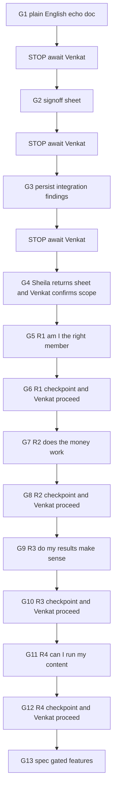
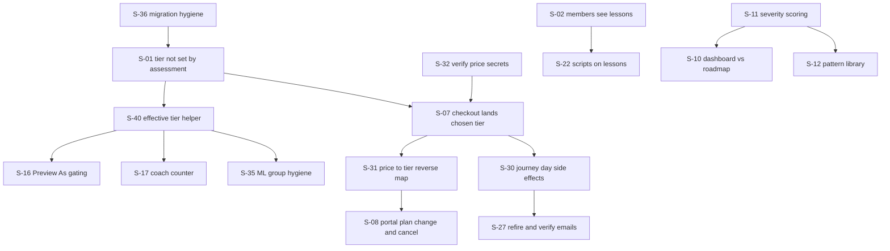

# Sheila UAT Remediation Plan

Source: [HWH_Portal_UAT_Test_Workbook-20260725.xlsx](../HWH_Portal_UAT_Test_Workbook-20260725.xlsx)

Her verdicts: Phase 1 Studio **Not yet**, Phase 2 Assessment **Not yet**, Phase 3 Delivery **No**, Phase 5 Billing **Not yet**, Phase 6 MailerLite **More testing needed**.

## Gate protocol — read this first

Every stage below is **paused by default**. The agent produces exactly one deliverable, stops, and waits.

- **Nothing starts without an explicit "proceed" from Venkat naming the gate.** Not implied by earlier approval, not carried over from a previous gate, not inferred from a plan being attached.
- **One gate, one deliverable, then a full stop.** No chaining two gates in a single run, even when the next step is obvious or cheap.
- **Each gate reports before stopping:** what was produced, what was verified, what it cost, and what the next gate would be. Then it stops without starting it.
- **Sheila's sign-off and Venkat's proceed are separate gates.** Her approval of scope does not authorise a build; Venkat still says go.
- **A gate that fails does not roll forward.** It reports the failure and stops for a decision.

Gate order: **G1** plain-English echo doc, stop. **G2** sign-off sheet, stop. **G3** integration findings persisted, stop. **G4** Sheila returns the sheet and Venkat confirms scope. **G5** R1, stop. **G6** R1 checkpoint. **G7** R2, stop. **G8** R2 checkpoint. **G9** R3, stop. **G10** R3 checkpoint. **G11** R4, stop. **G12** R4 checkpoint. **G13** spec-gated features.

---

## G1 — Plain English first, then stop

The only thing produced at this gate:

- `instant-site-move/docs/uat/UAT_SHEILA_ACK_2026-07-25.md` — the plain-English echo (Section A below). One line per item: what she told us, what she gets, what she does not get. Includes the two corrections in her favour and the one against, and the four decisions we need from her.

Not at this gate, each behind its own proceed:

- **G2:** `designdoc/HWH_Fix_Signoff_2026-07-25.xlsx` — the sign-off sheet she fills in, same shape as the workbook she already completed.
- **G3:** `instant-site-move/docs/uat/INTEGRATION_REVIEW.md` — technical findings so no future session rediscovers them, plus corrections to `DELIVERY_INVENTORY.md`, `BACKLOG.md` and `MAILERLITE.md`, which currently claim the day 18/19/21 journey emails are wired when they are not.

### Why a spreadsheet and not just the markdown

She completed a six-tab workbook with detailed per-row notes and returned it. That is proven behavior. Prose documents asking for decisions have historically stalled. So the markdown is for Venkat's review and the record; the spreadsheet is what actually gets her signature.

### How the sign-off sheet is built to make "yes" easy

- One row per fix. Columns: what you told us, what you will get, what you will not get, **Approve? (Yes / Change it / Skip)**, your notes.
- Pre-filled with our recommendation so the default action is a single word.
- Grouped by release, so she approves R1 before R2 matters, and a "Change it" on one row never blocks the others.
- A separate short tab, **Decisions only**, with at most four questions, each carrying a recommended default she can simply confirm.
- Rows we are declining or deferring are listed too, with the reason. Nothing silently disappears.
- Version and date in the filename so approvals are attributable later.

### The four decisions we need from her

- **Pricing:** the code creates a genuine 21-day trial with no charge, then bills the tier she picked. Her test guide says Awareness $19, the upgrade page shows different prices, and the results page promises $29 Foundation. Confirm one story and we align code and copy to it.
- **Day 19:** unlock content only, or also change what they are billed? Our recommendation and the plan default is content only.
- **Lesson check-ins:** how often, how many questions, what happens on a weak answer.
- **Script source:** confirm `HWH_Pain_Points_False_Beliefs_Master-2` and the four hook types are authoritative.

### Getting the signature without chasing her

- Send the echo doc and the sheet together, with a one-paragraph summary at the top: three things were broken at the foundation, here is what changes, approve the first batch only.
- Offer a 20-minute walkthrough call. Capture her verbal answers directly into the sheet, then send it back for a one-word confirm. Faster than waiting on written replies for 40 rows.
- Ask for R1 approval only, within 48 hours. R2 to R4 rows are visible for context but not required yet.
- State plainly that unanswered rows default to our recommendation after the deadline, so momentum is not lost. Nothing controversial is in that set.
- Include the two corrections in her favour and the one against, up front. It builds trust that the review is honest: the Day 18/19/21 emails were never going to arrive, her MailerLite groups are quietly degrading, and sign-out does exist but we buried it in an avatar menu.

---

## Gated delivery — four releases

Each release is a batch she can independently verify. No release begins before the previous checkpoint is signed off.

Each arrow below is a manual proceed from Venkat, not an automatic transition.

### R1 — "Am I the right member?" (about 64h, superseded)

**Superseded by [Batch 1 Implementation](BATCH_1_IMPLEMENTATION.plan.md), which is the authoritative R1 plan.** It grew from 40h to 64h after Sheila's corrections of 25 July: severity scoring pulled forward from R3, the two competing recommenders unified, the effective-tier helper made trial-aware, and `pending_tier` added.

Her checkpoint is UAT 1a, a 29-row workbook in the same format as UAT 1, closing about 29 of her 61 non-passing rows.

### R2 — "Does the money work?" (about 44h, revised 25 July)

**Revised after her pricing answer. The old goal, "checkout lands the chosen tier", is the wrong goal.** Her model has no free trial: $19 once for 21 days, Foundation access throughout, Restoration from day 19, then $29 Foundation by default. The code creates a 21-day free Stripe trial on the selected tier. That is a checkout redesign, not a metadata fix.

Contents: S-07 rebuild checkout to the $19 / 21 day / then $29 model 12h, S-41 honour `pending_tier` at day 22 so a trial selection takes effect without granting early access 4h, S-31 price-ID-to-tier reverse map so Stripe-side plan changes reach the portal 5h, S-08 portal plan change and cancel 2h, S-30 fire the four journey triggers from `advance-journey-day` on the production cron 8h, S-34 `invoice.paid` and `trial_will_end` handling 3h, S-35 MailerLite group removal on tier change 2h, S-27 re-fire and verify emails 3h, S-28 document submit versus reminder names 1h, S-29 re-test `trial_started` and `tier_upgrade` 2h, plus S-33 pricing copy alignment 2h.

Three corrections folded in:

- **S-30 is not "the portal sends the emails".** MailerLite sends them. `advance-journey-day` must fire the triggers it already has names for. See section 4 of `docs/uat/INTEGRATION_REVIEW.md`.
- **S-35 halves.** Trial outranking tier for group choice is correct under her model. Only the add-only behaviour is a bug.
- **Pricing is answered, no longer blocking.** Awareness $9, Foundation $29, Guided $69, Restoration $119, Integration $299, and the $19 is the trial charge, not a tier price.

Her checkpoint, UAT 2a: pay $19, land on Foundation with a visible trial end date, watch access widen to Restoration on day 19, change plan and cancel from the portal, and receive the day 18, 19 and 21 emails with nothing run by hand.

### R3 — "Do my results make sense?" (about 31h, revised 25 July)

**S-11 severity scoring moved into Batch 1**, because it reads the same intake answers as the tier recommender and shipping them apart would have given her a coherent tier next to incoherent pattern labels.

Contents: S-10 dashboard and roadmap agreement with the gut-first rule 10h, S-12 Pattern Library personalization and where-to-go-next order 8h, S-13 Start Here reflects results 4h, S-14 baseline reviewable after submit 3h, S-15 intake UX fixes 3h, S-23 progress check-in view 3h.

Her checkpoint, UAT 3a: two fresh assessments, one mild and one severe, and the results must match her clinical expectation. This is the release only she can judge, so it gets the most of her time.

### R4 — "Can I run my content?" (about 36h, 24 percent)

Contents: S-20 pillar-specific pain points, false beliefs and four hook types 10h, S-21 open a saved script 4h, S-22 scripts on published lessons 4h, S-24 paragraph output option 3h, S-17 coach counter per tier 3h, S-18 coach relevance and real progress context 6h, S-19 em-dash scrub with lint guard 4h, S-39 register unreachable admin routes 2h.

Her checkpoint, UAT 4a: she scripts one real video end to end and signs off Phase 1 Studio.

Confirmed by her on 25 July: the four hook types Pattern Disruption, Hidden Driver, Misinterpretation and Unexpected Connection are authoritative, and `HWH_Pain_Points_False_Beliefs_Master-2` is the current file. No new content file is needed.

### After R4, spec-gated

S-25 Progress Reflection Check-Ins and S-26 deliverables dashboard into social scheduling (20h or more).

**S-25 is no longer unspecified.** On 25 July Sheila confirmed it is a real gap against the existing Sequential Content Locking document, not new work, and gave the flow: a weak answer redirects the member to the specific part of the lesson the question came from, offers a retake, and after a second weak answer shows a Contact Support button to support@herwellnessharmony.com. It applies to Foundation tier and above and must not depend on AI Coach, which only starts at Guided. It also produces a signal for which lessons generate repeated weak answers.

Still open on S-25, and the one thing she asked us to advise on: question format and count. Recommend two to three multiple choice questions per check-in, because it grades deterministically, drives her redirect-and-retry flow, and works at Foundation tier where there is no AI Coach to grade free text. Estimate 16h to 20h once she confirms.

### Totals, revised 25 July

R1 64h, R2 44h, R3 31h, R4 36h: about **175h, 22 working days**. With the spec-gated features: about **215h, 27 days**.

The increase over the original 151h is not scope creep. It is the checkout redesign her pricing answer requires, plus the second recommender and the trial-aware tier rule that the code review found.

### Each release ends in its own UAT workbook

UAT 1a, 2a, 3a and 4a, each in the exact format of the workbook she already completed: `Section | Step | Your UAT 1 Note | What To Do | What You Should See | Pass / Fail | Your Notes`, tabs mirroring her phases, and a `Not In This Round` tab listing everything still pending with the batch that will answer it. Her original words open every row. Between them the four workbooks must account for all 61 of her non-passing rows and all 8 skipped rows, so nothing she raised is ever silently dropped.

---

## Budget reality

Usage is at $110 of $150, so about $40 remains. That does not cover 151 hours of implementation. Practical allocation:

- **Spend the remaining budget on Gate 0 and the same-day wins.** The echo doc, sign-off sheet and persisted findings are one cheap session. The 4.75h of trivial fixes in R1 — blank editors, rename, sign-out, new-tab, Deep Support nav, price-secret audit — are small, isolated edits.
- **Persist the findings before anything else.** The integration review in this conversation is expensive knowledge. Written to `INTEGRATION_REVIEW.md`, no future session re-explores Clerk, Stripe, the schema or MailerLite. Not writing it down is the single most costly mistake available.
- **Token discipline for the release work:** no broad codebase sweeps, since the root causes are already located file by file; work within the named files per item; batch edits per release rather than per item; keep verification to the specific SQL and dashboard checks listed rather than exploratory reading.
- **Expect to top up before R2.** R2 and R3 are the expensive halves, both because of the Stripe and scoring logic and because each needs a verification round.

---

## Section A — The plain-English echo (source for the Gate 0 document)

One line per item: what she saw, what we change.

### The big one: everybody looks like a Restoration member

- **You saw:** every account shows the Restoration badge, even free accounts with no payment, and before Day 19. **We fix:** the assessment currently *sets* your membership level to the tier it recommends. It will only *suggest*. Membership comes from payment alone.
- **You saw:** Preview As Awareness or Foundation changes nothing. **We fix:** previews apply real tier limits once membership stops being overwritten.
- **You saw:** Studio menus stay visible while previewing as a member. **We fix:** admin studios hide in member preview.
- **You saw:** no free or no-tier preview option. **We add:** a free-member preview so you can test locked screens without a second login.
- **You saw:** Symptom Log and videos open before payment. **We fix:** these follow the corrected membership level.
- **New from us:** after this, an unpaid member who finished the assessment sees their recommended tier as a recommendation with an upgrade prompt, not as a membership they already hold.

### Members cannot see their roadmap

- **You saw:** lessons show for the admin account only; other users see an empty roadmap. **We fix:** members can only see lessons marked Published, and the catalog is unpublished, so we publish the roadmap lessons.
- **You saw:** only NS-01 has a script, action items and reflection. **We fix:** the other lessons need scripts saved against them, and an empty lesson will say so instead of looking broken.
- **You saw:** My Progress works for the admin account only. **We fix:** same root cause.

### Naming and navigation

- **You said:** the sidebar should read **My Guided Roadmap**, not Guided Pathways. **We change:** the label.
- **You said:** **Deep Support Coaching** is missing, and after the assessment there is no way back to membership options. **We restore:** the link and the route.
- **You saw:** no Sign Out button. **Correction from us:** it exists, hidden in the small avatar menu at the bottom of the sidebar. That is our fault for making it invisible, so **we add** a plain Sign Out item.

### Assessment results do not match the roadmap

- **You saw:** the dashboard says primary is metabolic while the roadmap starts with gut. **We fix:** one source of truth, and gut comes first when gut is driving metabolism and hormones, exactly as you described.
- **You saw:** you rated everything mild, 7 to 10, and patterns still came back medium to high. **We fix:** the severity scoring so mild ratings produce mild patterns.
- **You saw:** Pattern Library shows the same default cards on every account, even before an assessment. **We fix:** cards come from that person's own results, and nothing shows before an assessment.
- **You saw:** where-to-go-next on a pattern card disagrees with your roadmap order. **We fix:** it follows the roadmap sequence.
- **You saw:** Start Here shows nothing after a fresh account completes the assessment. **We fix:** Start Here reflects results and journey day.
- **You asked:** baseline numbers reviewable right after submitting, not only at Day 11. **We add:** a read-only baseline summary after submit.

### Assessment form details

- **You saw:** pregnancies, deliveries and miscarriages accept negative numbers. **We fix:** zero or higher only.
- **You said:** ask current symptoms first, then history, and do not offer a current symptom again as a past symptom. **We change:** order and de-duplicate.
- **You said:** the scale should read 1 equals severe symptoms and 10 equals no symptoms. **We change:** the wording.
- **Our error, not yours:** your workbook step numbers were off by one. Symptom Inventory is Step 6, not 5. We will correct the guide.

### Trial, billing and Stripe

- **New from us, important:** the Day 18, Day 19 and Day 21 emails were never going to arrive for a real member. We wired those triggers into a test script and never wired them into the product, so they only fire when that script is run against an account. MailerLite is already waiting for them and will send them the moment the portal starts firing them on schedule.
- **New from us:** the Day 19 automatic upgrade to Restoration also only happens in that script. We are implementing it properly. Our recommendation, subject to your confirmation, is that Day 19 unlocks what you can see and does not change what you are billed.
- **You saw:** the button says Start Free Trial but it charges. **We need your decision:** the code creates a genuine 21-day trial with no charge, then bills the tier the member picked. Your test guide lists Awareness at $19, the portal page shows different prices, and one screen promises $29 Foundation. Three different stories. Confirm one and code and wording will match it.
- **You saw:** after paying, the account shows Restoration instead of the tier chosen, and some users show no subscription. **We fix:** payment drives the tier, the assessment can no longer overwrite it, and we are auditing the price configuration, since a mis-set price is a likely second cause.
- **You saw:** no trial end date on the Account page. **We add:** it.
- **You saw:** checkout and Manage Billing open in the same tab. **We change:** both open in a new tab.
- **You saw:** the billing portal is empty with no way to change plan or cancel. **We fix:** that is Stripe configuration. We enable both, and we make a plan change in Stripe update the tier in the portal, which it does not do today.

### Content Studio

- **You saw:** the Member Content editor and Weekly Notes editor are blank. **We fix:** one line of broken code stops both pages loading. After that, publishing and tier-gating can be tested.
- **You saw:** the Social Script Generator shows the same pain points and false beliefs for every pillar, and the wrong hook types. **We fix:** load your real pillar-specific content and your four hook types: Pattern Disruption, Hidden Driver, Misinterpretation, Unexpected Connection.
- **You saw:** a script saves but you cannot find it again. **We add:** open and re-read a saved script from the video library.
- **You asked:** one place to manage all deliverables and push to social scheduling. **We propose:** a separate spec after the blockers; the saved-script view is the interim step.
- **You asked:** scripts as one flowing paragraph. **We add:** a paragraph option, keeping sections available.
- **Cosmetic only:** the green versus blue border on the strength card means nothing is wrong. Say the word if you want blue.

### AI Coach

- **You saw:** the counter shows 150 for every tier and does not reset. **We fix:** it follows real tier limits.
- **You saw:** an answer that did not match the question, and it claimed you had finished lessons you had not. **We fix:** the coach reads actual progress and answers the question asked.
- **You said:** remove long dashes everywhere. **We do:** strip them from coach replies, lesson scripts and site copy, and add an automated check so they cannot return.

### Mini check-ins between lessons

- **You said:** there should be a short check-in every couple of lessons, and none are happening. **Status:** correct, this was never built. Day 11, Day 21 and semi-monthly check-ins exist; lesson-level check-ins are new work and need a short spec from you.

### Emails (MailerLite)

- **Status:** all 12 reminder emails are now built and Active. When you tested, only the first existed, which is why nothing else arrived.
- **You saw:** the portal sends `day_11_mini_assessment` while the automation listens for `day_11_mini_assessment_reminder`. **Explanation:** two different emails by design. The reminder nudges you to do the check-in; the submit event fires when you finish it. Nothing is misnamed. If you want a "we got your check-in" email too, we will add it.
- **New from us:** while someone is on trial they land in HWH Trial Members regardless of tier, and we only ever add people to groups, never remove them from the old one, so members accumulate groups. We will fix the group hygiene so your segments stay clean.
- **Status:** the `trial_started` and `tier_upgrade` tests were skipped; we re-run them in R2.

---

## Three gaps the integration review found that Sheila could not see

Not in her workbook because no test step could reveal them.

- **Day 18 / 19 / 21 / 22 journey emails do not exist in production.** [`advance-journey-day`](supabase/functions/advance-journey-day/index.ts) only increments the day and logs to console; all four triggers live in [`scripts/simulate-day.sh`](scripts/simulate-day.sh). Her Phase 5 rows only produced email because we ran that script against her account. We then wrote docs claiming the production path worked, which is why it went unnoticed.
- **The Day 19 Restoration unlock is also script-only**, and it changes Supabase without touching Stripe.
- **Core tables are not under migration control.** `subscribers`, `intake_responses`, `pattern_maps` and `subscriber_progress` come from [`sql/portal_schema.sql`](sql/portal_schema.sql) with RLS in [`sql/rls_policies.sql`](sql/rls_policies.sql), applied by hand. We cannot prove production matches the repo, and `subscriber_progress` lacks the unique constraint its own upserts depend on.

---

## End-to-end change contract

Every P0 change, and every layer it touches, so nothing is fixed at the UI while the data stays wrong.

### S-01 and S-40 — tier means "what you paid for"

- **Supabase data:** `identify-patterns` stops writing `tier`; recommendations live on `member_roadmaps.recommended_tier` and `pattern_maps.recommended_tier`. Backfill clears `subscribers.tier` only where `stripe_subscription_id IS NULL AND payment_status = 'none'` and the tier equals a stored recommendation. Rows with `payment_status IN ('trial','active')` are never touched.
- **Supabase RLS:** `content_items_select_tiered` reads `subscribers.tier`; a NULL tier must mean free, not an accidental empty result.
- **Frontend:** one `useEffectiveTier()` helper replaces the ad-hoc ternary repeated across `PortalContent`, `PortalLesson`, `PortalAICoaching`, `PortalPrioritySupport`, `PortalSymptomLog` and `PortalWeeklyNotes`.
- **UX:** an unpaid post-assessment member sees a recommendation and an upgrade path, never a badge implying membership.
- **Clerk:** no change; Clerk stores no tier.
- **Stripe:** becomes the only writer of `subscribers.tier`.
- **MailerLite:** group derived from the same helper so segments match the portal.

### S-30 — journey day side effects in production

- **Supabase:** day 18 / 19 / 21 / 22 handling in `advance-journey-day`, writing `subscriber_progress`.
- **Stripe:** no mutation. Day 19 is content unlock only, confirmed.
- **MailerLite:** fire the four journey triggers with tier and payment status in `trigger_data`, idempotent through `mailer_lite_trigger_log`.
- **Docs:** correct the three files that claim this already works.

### S-07, S-31, S-32 — checkout lands the chosen tier

- **Stripe config:** audit the five `STRIPE_PRICE_*` secrets. A Foundation-to-Restoration swap alone reproduces her report.
- **Stripe code:** add a price-ID-to-tier reverse map so Customer Portal plan changes update the tier, and write metadata back.
- **Supabase:** tier, payment status, trial dates and Stripe ids all from webhook events; add `invoice.paid` and `trial_will_end`.
- **Frontend:** Account page reads those columns, including trial end date.
- **MailerLite:** existing billing triggers fire with the correct tier.

### S-02 and S-22 — members see their roadmap

- **Supabase data:** publish the roadmap catalog rows; `production_status` defaults to `not_started` and members are limited by `member_read_published_videos`.
- **Frontend:** explicit empty state so zero lessons is visible rather than silent.
- **Content:** scripts beyond NS-01 are her content work; code degrades gracefully until then.

### S-36 — schema and migration hygiene

- Bring `portal_schema.sql` and `rls_policies.sql` under `supabase/migrations` as idempotent migrations, verify production matches, add the missing unique constraint on `subscriber_progress.subscriber_id`.

### S-37 and S-38 — integrity of the integrations

- **Clerk to Supabase:** portal edge functions accept a Clerk JWT then ignore it and act as service role on whatever `subscriber_id` the caller passes. Bind JWT `sub` to the subscriber row in `ai-coach`, `create-checkout-session`, `create-portal-session`, `identify-patterns` and `finalize-assessment`; add an admin check to `admin-analytics`; enable `verify_jwt` where it is off.
- **Clerk lifecycle:** email is copied once at row creation and never re-synced, and a deleted Clerk user orphans a subscriber. Add `user.updated` and `user.deleted` webhooks.

---

## Dependencies and easy wins

### Same-day wins, about 4.75h combined

S-03 blank editors, S-05 rename, S-06 sign-out, S-09 new tab and wording, S-04 Deep Support nav, S-32 price secret audit, S-28 trigger-name doc.

### Highest leverage per hour

S-01 at 3h clears or unblocks the badge, Preview As, Symptom Log gating, coach counter, Account page and Day 19 verification. S-32 at 1h may explain the wrong tier after checkout by itself.

### Ordering constraint

S-36 comes first. Until schema and RLS are under migration control we cannot prove a database fix reached production, which is exactly how the day 18/19/21 claim went stale.

### Blocked on Sheila

Pricing model, Day 19 billing question, lesson check-in spec, script source confirmation, and scripts for lessons beyond NS-01.

### No code change, explanation only

Green versus blue border; workbook step numbering, which is our error; `day_11_mini_assessment` versus the reminder name, two intentional events; Phase 5 Section 6 not-testable rows.

---

## Per-layer verification, run before each checkpoint

Each layer checked independently, never inferred from the screen.

- **Supabase:** SQL proving no unpaid subscriber holds a tier, production RLS matches the repo, published lesson count non-zero for a member role.
- **Clerk:** fresh sign-up creates exactly one subscriber row, email change propagates, sign-out reachable in two clicks.
- **Stripe:** each price maps to the intended tier, a Foundation test checkout yields `tier = foundation`, portal offers plan change and cancel, a plan change updates the portal.
- **MailerLite:** `last_trigger` and group correct after each fire, nobody stranded in a stale tier group, reminder emails land.
- **Journey:** advance a test account through days 18 to 22 on the production cron path, not `simulate-day.sh`, and confirm emails send unaided.
- **UI flow:** fresh non-admin account end to end — assess, recommendation with upgrade prompt, pay, correct tier and trial end date, roadmap lessons visible, Pattern Library personalized, Member Content publishes and gates.

---

## Appendix — confirmed root causes

- **Restoration everywhere:** [`identify-patterns`](supabase/functions/identify-patterns/index.ts) writes Claude's `recommended_tier` into `subscribers.tier`, the column the badge and every gate reads. It can also overwrite a real Stripe tier on re-assessment. [`PortalIntake`](src/pages/portal/PortalIntake.tsx) does the right thing then invokes the function that undoes it.
- **Admin-only lessons:** RLS limits members to `production_status = 'published'`, seeds default to `not_started`, so non-admins get zero rows and `PortalPathways` renders an empty roadmap with no error.
- **Blank editors:** [`MemberContentEditor`](src/pages/portal/studio/MemberContentEditor.tsx) calls `useSupabase()` with no import and throws on mount; both routes share it and there is no error boundary.
- **Missing journey emails:** `advance-journey-day` logs days 18 and 22 to console and never calls `fire-mailerlite-trigger`.
- **Wrong tier after checkout:** `stripe-webhook` trusts `subscription.metadata.tier` and never reverse-maps the price.
- **MailerLite drift:** groups are add-only, trial status outranks tier, and mini-assessment submits send no tier or payment status, defaulting those members into the Free group.

---

## Decisions taken

- **Confirmed by Venkat:** Day 19 unlocks content access only, no Stripe mutation mid-trial. The `day_19_restoration_unlocked` email still fires.
- **Confirmed by Venkat:** the integrity work S-37 and S-38 ships inside R1, before real payments run through those functions.
- **Confirmed by Venkat:** gated delivery in four batches with a Sheila checkpoint after each, and no code before her sign-off.
- **Confirmed by Venkat:** every gate is paused by default and needs an explicit proceed from him naming the gate. One deliverable per gate, then a full stop, no chaining. G1 is the plain-English echo doc and nothing else.
- Stay in Stripe test mode for these rounds; going live is a separate checklist.
- Ship the saved-script view before designing the deliverables dashboard.

### Confirmed by Sheila, 25 July

- **Pricing, closed.** Awareness $9, Foundation $29, Guided $69, Restoration $119, Integration $299. The trial is a one-time $19 for 21 days, no free option. Auto-billing after the trial defaults to $29 Foundation. The $19 in the test guide against Awareness was our documentation error.
- **Day 19, closed and stronger than our recommendation.** There is no billing change at day 19 or at any point during the trial. The $19 already covers the Restoration days. Access widens, nothing is billed.
- **Trial access rule.** Foundation for days 1 to 18, Restoration for 19 to 21. A tier selected during the trial does not take effect until day 22, which is why `pending_tier` exists.
- **Groups and triggers coexist.** Groups are for one-off broadcasts to a single tier and are not replaced by trigger-based email. Every subscriber must land in their correct tier group.
- **Script sources authoritative.** The four hook types and `HWH_Pain_Points_False_Beliefs_Master-2` are current. No replacement file needed.
- **Progress Reflection Check-Ins are a gap, not new work.** Flow specified by her; only question format remains open.

### Still open

- Whether the $19 is charged upfront at checkout, which determines whether Stripe carries a trial at all. Affects R2 only.
- Question format and count for the Progress Reflection Check-Ins. Our recommendation is two to three multiple choice.
- Whether she wants a "we got your check-in" confirmation email, and whether the strength card border should be blue.
